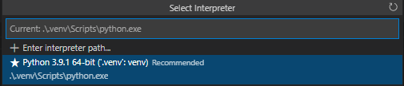
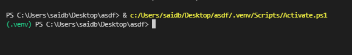
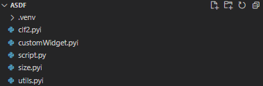
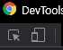
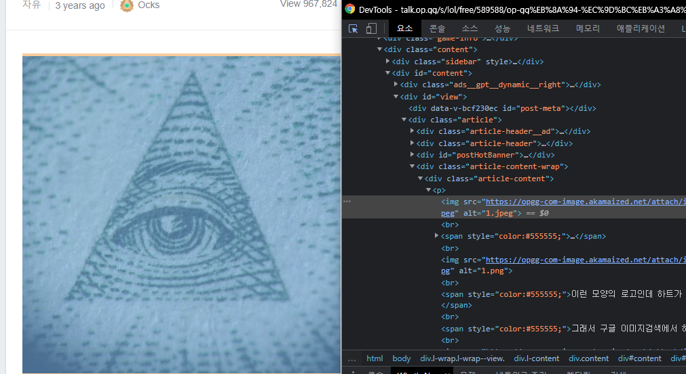
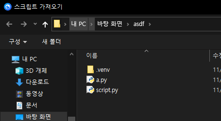
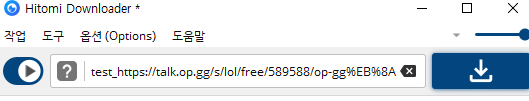
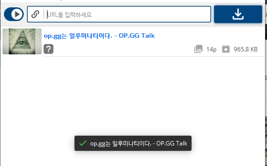

## 두려워져요

물론 기존에 작성되어있는 [예제](https://github.com/KurtBestor/Hitomi-Downloader/wiki/How-to-write-a-script)가 있긴하다.

근데 저것만으로는 어케 작성할지 막막하다.

이 글을 보면 어느정도는 작성이 가능할것이다.

## 준비물

1. Python3
2. bs4를 써보았다.
3. requests를 써보았다.

어느정도 프로그래밍 지식을 알고있다는 가정하에 이 글을 작성할것이다.

제가 그래야 설명하기 편하거든요.

## 진짜 준비

https://github.com/Hitomi-Downloader-extension/Hitomi-Downloader-Stubs/releases/tag/For-Download

스텁파일을 받아두자.

KurtBestor님이 제공해주신 소스코드를 바탕으로 작성된 타입힌팅 파일이다.

모든 메소드는 아니더라도, 주로 쓰이는 메소드는 힌팅이되있다.

글쓴이의 개발환경은 이러하다.

* Windows 10
* Python 3.9.1 (venv)
* VScode
* Pylance (strict)

본인은 타입힌트를 엄격하게 적용한다.

근데 적용 안해도 문제는 없고 괜히 돌리면 머리아파지니 기본값인 basic 모드로 돌리고 힌팅만 제공받도록하자.

## 자 드가자~

Venv 설정을 빠르게 해주도록하자.

```sh
py -m venv .venv
```



vscode 콘솔 재시작.



일케 뜨면 정상.

스텁 파일들을 작업폴더에 붙여넣자.



```sh
pip install requests bs4
```

필요한것들을 설치해주자.

이러면 거의 준비가됬다.

## 사이트 뜯기

그나마 구조가 쉬운 talk.op.gg를 빠르게 뜯어볼것이다.

~~미안해요 옵지~~

링크: [op.gg는 일루미나티이다.](https://talk.op.gg/s/lol/free/589588/op-gg%EB%8A%94-%EC%9D%BC%EB%A3%A8%EB%AF%B8%EB%82%98%ED%8B%B0%EC%9D%B4%EB%8B%A4)

글의 사진을 전부 가져와보자.

<kbd>Ctrl</kbd> + <kbd>Shift</kbd> + <kbd>I</kbd> 를 눌러 빠르게 콘솔창 진입.



첫번째꺼 누르기 



이미지를 가져다대고 엘리먼트를 보면

"아 class=article-content에 내용들이있고 img엘리먼트를 뽑아내면되겠구나~"

라고 알수있다.

그러면 이 작업을 코드로 짜보도록하자.

```py
from bs4.element import Tag
import requests
from bs4 import BeautifulSoup

# 내용 요청
r = requests.get("https://talk.op.gg/s/lol/free/589588/op-gg%EB%8A%94-%EC%9D%BC%EB%A3%A8%EB%AF%B8%EB%82%98%ED%8B%B0%EC%9D%B4%EB%8B%A4")

# html로 가져오기.
data = r.text

# BeautifulSoup 객체로 만들어주기.
bs = BeautifulSoup(data)

# div의 article-content 클래스인 엘리먼트 찾기
article_content = bs.find("div", class_="article-content")

# 만약 Tag속성이면..
# 타입을 정확하게 지정해주기 위한 방법이다.
# 이것을 쓰지 않을경우 article-content의 반환은 다음과같다.
# Tag | NavigableString | None
if isinstance(article_content, Tag) :
    # article content에서 img엘리먼트를 전부 가져온다.
    image_element_list = article_content.find_all("img")

    # img 엘리먼트에서 src만 뺌
    result = [image_element["src"] for image_element in image_element_list]

    # 결과출력
    print(result)

```

실행 결과는 다음과같다.

```sh
['https://opgg-com-image.akamaized.net/attach/images/20190426113210.393073.jpeg', 'https://opgg-com-image.akamaized.net/attach/images/20190901154547.393073.jpg', 'https://opgg-com-image.akamaized.net/attach/images/20190901154613.393073.jpg', 'https://opgg-com-image.akamaized.net/attach/images/20190901154709.393073.jpg', 'https://opgg-com-image.akamaized.net/attach/images/20190901154754.393073.jpg', 'https://opgg-com-image.akamaized.net/attach/images/20190901154828.393073.jpg', 'https://opgg-com-image.akamaized.net/attach/images/20190901154852.393073.jpg', 'https://opgg-com-image.akamaized.net/attach/images/20190901154929.393073.jpg', 'https://opgg-com-image.akamaized.net/attach/images/20190901155001.393073.jpg', 'https://opgg-com-image.akamaized.net/attach/images/20190901155035.393073.jpg', 'https://opgg-com-image.akamaized.net/attach/images/20190421002639.393073.png', 'https://opgg-com-image.akamaized.net/attach/images/20190421002714.393073.png', 'https://opgg-com-image.akamaized.net/attach/images/20190421002818.393073.png', 'https://opgg-com-image.akamaized.net/attach/images/20190421002956.393073.png']
```

아주 완벽하게 뽑혔다.

그러면 스크립트를 짜보자.


```py
import requests

# stub 파일을 적용했다면 utils가 노랑색으로 뜰것이다.
# 무시해도 좋다.
# utils내부에 있는 Soup객체를 쓰도록하자.
from utils import Downloader, Soup

# 다운로더에 등록하는 클래스 메소드다.
@Downloader.register
# Downloader클래스를 상속받지 않을경우 문제가된다.
class DownloaderTalkOPGG(Downloader):
    # 타입을 지정해준다.
    type = "talkopgg"
    # 인식할 url을 지정해주자.
    URLS = ["talk.op.gg"]

    # 이 메소드 없으면 스크립트 로드시 문제생김
    def init(self) -> None:
        pass

    # 읽기 끝
    def read(self) -> None:
        # 밑에 코드는 위에 작성했던코드를 줄인것이다.
        response = requests.get(self.url)
        soup = Soup(response.text)

        self.title = soup.find("title").text

        image_element_list = soup.find("div", class_="article-content").findAll("img")

        for image_element in image_element_list:
            self.urls.append(image_element["src"])
```

끝났다.

정말 쉽지않나?

해당 옵지는 이미 히토미 다운로더에 등록되어있다.

~~왜냐하면 필자가 PR을 넣었기 때문....~~

그러므로 테스트가 힘들텐데, 어케 테스트를 할것인가?

간단하다.

```py
class DownloaderTalkOPGG(Downloader):
    # 그냥 타입만 바꿔주자~
    type = "test"
```

이제 히토미 다운로더를 켜보자.

스크립트 로드는 다음과같이 할수있다.

<kbd>Alt</kbd> + <kbd>S</kbd>



``script.py``를 로드하자.

다음과 같이 넣어주자

``test_:옵지링크:``



결과는?



끝!


시간나면 js렌더링이 필요한 사이트도 한번 뜯어보도록 합시다.